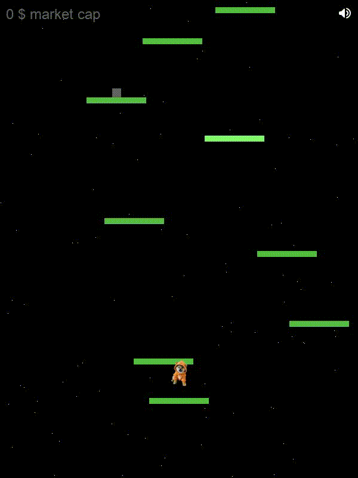

# DOG Game
This repository contains a modified version of the Pygame-DoodleJump game, originally created by [MykleR](https://github.com/MykleR/Pygame-DoodleJump). This version has been customized with new features and aesthetic improvements, while retaining the spirit of the original game.

## Table of Contents
* [General Info](#general-info)
* [Features](#features)
* [Requirements](#requirements)
* [Setup](#setup)
* [Credits](#credits)
* [License](#license)



## General Info
* Forked from the [original Pygame-DoodleJump repository](https://github.com/MykleR/Pygame-DoodleJump).
* No images used for graphics in the original version.
* Well-cleaned and organized code.
* Relatively small codebase.

## Features
* **Player Graphic**: The player character is now represented by a dog icon.
* **Enemies**: Added various enemies with custom images appearing at specific score levels.
* **Sound and Music**: Background music and various sound effects for jumping, game over, and other events.
* **Platforms**: Updated graphics for both fixed and moving platforms.
* **User Interface**: Enhanced UI with market cap indicators and a custom victory message.
* **Sound Control**: Added an icon to toggle game sounds on and off.
* **Score Line**: A fixed white line indicating the market cap level where enemies appear, with the corresponding score displayed.
* **Background**: Custom background image for the game.

## Requirements
* [Python3](https://www.python.org/downloads/)
* [Pygame](https://www.pygame.org/news)

## Setup
1. **Clone the Repository**:
    ```sh
    git clone https://github.com/MrRedeth/DOG-Game.git
    ```

2. **Navigate to the Project Directory**:
    ```sh
    cd DOG-Game
    ```

3. **Install the Requirements**:
    ```sh
    pip install -r requirements.txt
    ```

4. **Run the Game**:
    ```sh
    python main.py
    ```

## Credits
The original game was created by [MykleR](https://github.com/MykleR). All credits for the original game go to him.

## License
This project is released under the GNU Affero General Public License. See the `LICENSE` file for more details.

